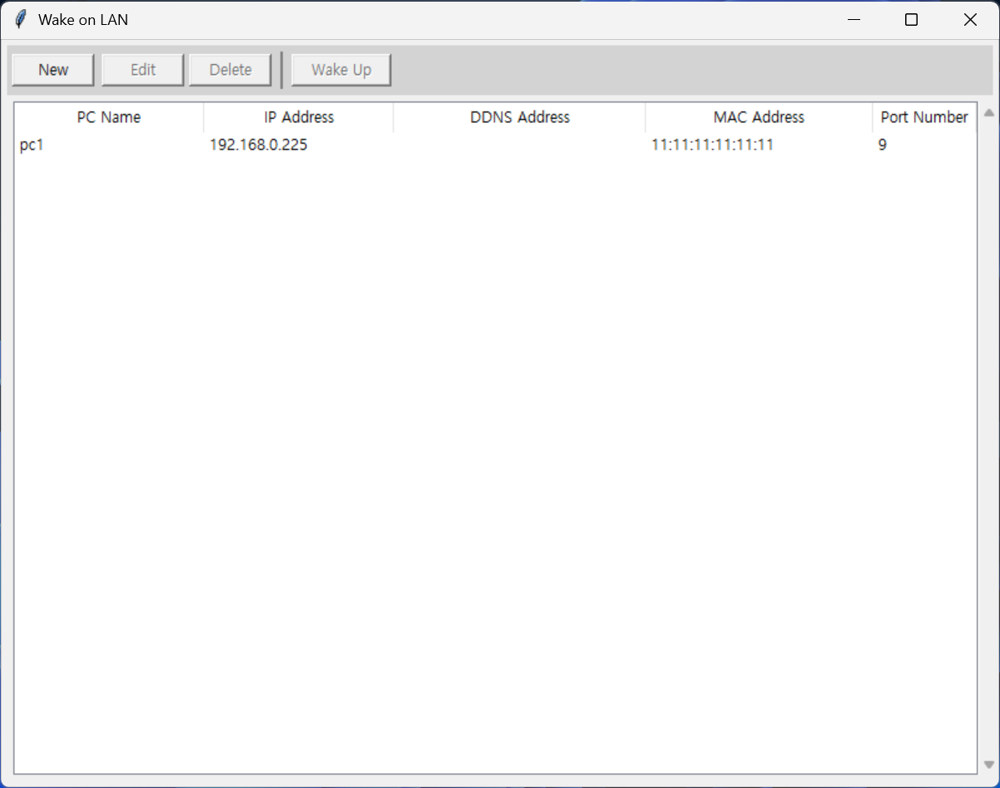

# Wake on LAN (WOL) Manager

A simple and intuitive GUI application for managing and sending Wake-on-LAN packets to remote computers.



## Features

- **PC Management**: Add, edit, and delete PC configurations
- **Flexible Addressing**: Support both IP and DDNS addresses
- **Wake-on-LAN**: Send magic packets to wake up remote computers
- **User-Friendly Interface**: Clean and intuitive GUI with keyboard shortcuts
- **Data Persistence**: Save PC configurations in JSON format

## Requirements

- Python 3.6+
- tkinter (usually included with Python)

## Installation

1. Clone this repository:
```bash
git clone https://github.com/yourusername/pyWakeOnLan.git
cd pyWakeOnLan
```

2. Run the application:
```bash
python WOL.py
```

## Usage

### Adding a New PC

1. Click the **New** button or press `Ctrl+N`
2. Fill in the required information:
   - **PC Name**: A friendly name for identification
   - **IP Address** or **DDNS Address**: Choose one (they are mutually exclusive)
   - **MAC Address**: The target computer's MAC address (XX:XX:XX:XX:XX:XX format)
   - **Port Number**: UDP port for Wake-on-LAN (default: 9)
3. Click **OK** to save

### Editing a PC

1. Select a PC from the list
2. Click the **Edit** button or press `Ctrl+E`
3. Modify the information as needed
4. Click **OK** to save changes

### Deleting a PC

1. Select a PC from the list
2. Click the **Delete** button or press `Delete` key
3. Confirm the deletion in the dialog

### Waking Up a PC

1. Select a PC from the list
2. Click the **Wake Up** button, double-click the PC, or press `Enter`
3. Confirm the wake-up action in the dialog

## Keyboard Shortcuts

- `Ctrl+N`: Add new PC
- `Ctrl+E`: Edit selected PC
- `Delete`: Delete selected PC
- `Enter` or `Double-Click`: Wake up selected PC
- `Arrow Keys`: Navigate between fields in dialogs

## Configuration File

PC configurations are automatically saved to `PCList.json` in the following format:

```json
{
  "pc_list": [
    {
      "name": "My Computer",
      "ip": "192.168.1.100",
      "ddns": "",
      "mac": "AA:BB:CC:DD:EE:FF",
      "port": 9
    }
  ]
}
```

## Error Handling

- **Invalid JSON**: If the configuration file is corrupted, the application will offer to reset it
- **DDNS Resolution**: If DDNS cannot be resolved, appropriate error messages are shown
- **Network Issues**: Wake-on-LAN failures are reported with detailed error messages
- **Input Validation**: All fields are validated for correct format before saving

## Troubleshooting

### Wake-on-LAN not working
1. Ensure the target computer has Wake-on-LAN enabled in BIOS/UEFI
2. Check that the network adapter supports Wake-on-LAN
3. Verify the MAC address is correct
4. Ensure the target computer is connected to power and network
5. **For external access**: Configure port forwarding on your router for the specified UDP port (default: 9)
6. **For external access**: Use the router's external IP address or DDNS address, not the internal IP

### DDNS resolution issues
1. Check your internet connection
2. Verify the DDNS address is correct and active
3. Check if your DNS server can resolve the address

## License

This project is licensed under the MIT License - see the [LICENSE](LICENSE) file for details.

## Contributing

1. Fork the repository
2. Create a feature branch
3. Make your changes
4. Test thoroughly
5. Submit a pull request